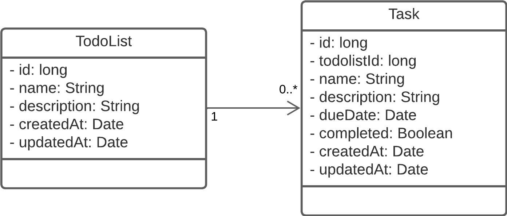

# Tech Challenge - Teste de recrutamento do NExT Seguros 2024.1

<!-- PROJECT SHIELDS -->

[](https://img.shields.io/badge/type-Open%20Project-green)
[](https://github.com/NExT-2024-1/desafio-spring/commits/master)
[](https://github.com/NExT-2024-1/desafio-spring/issues)
[](https://github.com/NExT-2024-1/desafio-spring/search?l=python)
[](https://img.shields.io/github/repo-size/NExT-2024-1/desafio-spring)
[](https://img.shields.io/github/contributors/NExT-2024-1/desafio-spring)
[](https://img.shields.io/github/stars/NExT-2024-1/desafio-spring)
[](LICENSE)
[](https://img.shields.io/badge/status-active-success.svg)


<p align="center">
  
</p>

## Overview

Bem-vindo ao teste de recrutamento do NExT Seguros 2024.1. Aqui no NExT Seguros nós realmente valorizamos código de qualidade, e este teste foi projetado para permitir que você nos mostre como você acha que código de qualidade deve ser escrito.

Para permitir que você se concentre no design e na implementação do código, adicionamos todos os casos de uso que esperamos que você implemente no final das instruções. Em troca, pedimos que você certifique-se de que sua implementação siga todas as melhores práticas que você conhece e que, no final, o código que você enviar seja um código do qual você se orgulhe.

Precisamos de pessoas com energia, integridade e inteligência, que aprendam rápido e que gostem de conhecer e aplicar novas tecnologias.

O tempo sugerido para conclusão do desafio é de 3 horas, mas não é uma regra! Não temos prazo para entrega, queremos que você se dedique e demonstre a qualidade de seu código. Estamos mais interessados em observar a qualidade da solução do que o tempo que você vai demorar.

Estamos interessados ​​em ver como você aborda o desafio, portanto, crie commits e envie-os com mais regularidade do que normalmente faria para que possamos ver cada etapa do desafio.

## Table of Contents

- [Desafio](#desafio)
- [Contexto](#contexto)
- [Instruções para o desafio](#instruções-para-o-desafio)
  - [Para o dia da entrevista técnica](#para-o-dia-da-entrevista-técnica)
- [Fluxo de Versionamento](#fluxo-de-versionamento)
- [Escopo do desafio](#escopo-do-desafio)
- [Requisitos](#requisitos)
  - [Funcionalidades da API](#funcionalidades-da-api)
  - [Persistência dos Dados](#persistência-dos-dados)
  - [Outras Funcionalidades](#outras-funcionalidades)
    - [GET: /todolists](#get-todolists)
    - [POST: /todolists](#post-todolists)
    - [PUT: /todolists/:id](#put-todolistsid)
    - [DELETE: /todolists/:id](#delete-todolistsid)
    - [GET: /tasks](#get-tasks)
    - [POST: /tasks](#post-tasks)
    - [PUT: /tasks/:id](#put-tasksid)
    - [DELETE: /tasks/:id](#delete-tasksid)
    - [GET: /tasks/overdue](#get-tasksoverdue)
    - [GET: /tasks/completed](#get-taskscompleted)
    - [GET: /tasks/today](#get-taskstoday)
    - [GET: /tasks/:id/subtasks](#get-tasksidsubtasks)
    - [POST: /tasks/:id/subtasks](#post-tasksidsubtasks)
    - [PUT: /tasks/:id/subtasks/:subtaskId](#put-tasksidsubtaskssubtaskid)
    - [DELETE: /tasks/:id/subtasks/:subtaskId](#delete-tasksidsubtaskssubtaskid)
- [Estrutura das Entidades](#estrutura-das-entidades)
  - [Lista de Tarefas](#lista-de-tarefas)
  - [Atividade](#atividade)

## Desafio

Nesse desafio, você irá desenvolver uma API REST para um sistema de gerenciamento de tarefas (To-Do List). Você irá praticar o que aprendeu até agora sobre Java e Spring Boot para criar uma pequena API para gerenciar listas de tarefas e atividades.

Essa será uma API que receberá requisições de um aplicativo móvel, e permitirá que os usuários criem, leiam, atualizem e excluam listas de tarefas e suas atividades correspondentes.

## Contexto

O sistema de gerenciamento de tarefas (To-Do List) permite que os usuários criem e organizem suas listas de tarefas, bem como as atividades que compõem cada lista. Cada lista de tarefas pode conter várias atividades, e essas atividades podem ser atualizadas conforme necessário.

Você foi encarregado de criar um serviço que permita o gerenciamento dessas listas e atividades. Para este desafio, você criará uma versão simplificada desse aplicativo codificando um endpoint de API simples que recebe e retorna dados em formato JSON.

## Instruções para o desafio

- Fork esse repositório e faça o desafio numa branch com o seu nome (exemplo: nome-sobrenome);
- Faça seus commits no seu repositório;
- Assim que concluir o seu desafio, abra um pull request com suas alterações para a branch main deste repositório.
- Fique à vontade para perguntar qualquer dúvida aos professores e monitores.
- Fique tranquilo, respire, assim como você, também já passamos por essa etapa. Boa sorte! :)

## Para o dia da entrevista técnica

Na data marcada pelo professor, tenha sua aplicação rodando na sua máquina local para execução dos testes e para nos mostrar os pontos desenvolvidos e possíveis questionamentos. Faremos um code review junto contigo como se você já fosse do nosso time ❤️. Você poderá explicar o que pensou, como arquitetou e como pode evoluir o projeto.

## Fluxo de Versionamento

Aconselhamos seguir o [versionamento semântico](https://semver.org/) e o [gitflow](https://www.atlassian.com/br/git/tutorials/comparing-workflows/gitflow-workflow) para versionar este desafio.

## Escopo do desafio

- Documentar todas suposições realizadas;
- O desenvolvimento do back-end deve ser em Spring Boot;
- Não é necessário submeter uma aplicação que cumpra cada um dos requisitos descritos abaixo, mas o que for submetido deve funcionar;
- Informar em um arquivo README.md o passo a passo necessário para rodar o projeto juntamente com o descritivo das funcionalidades que foram atendidas no desafio.

## Requisitos

-------------------------------------------------------------
<!-- Requisitos do Todo List -->

### Requisitos do To-Do List

<details>
<summary style="font-size:16px"><b>GET: /todolists</b></summary>

### Função

Deve haver uma rota para listar todas as listas de tarefas cadastradas;

### Requisição

**URL de Requisição**

> $ curl https://localhost:8080/todolists

#### Exemplo de requisição
```JSON
{

}
```

Retorna um array das listas de tarefas.

#### Exemplo de resposta

```JSON
[
  {
    "id": long,
    "name": String,
    "description": String,
    "createdAt": Date,
    "updatedAt": Date
  },
  {...},
  {...}
]
```
</details>

<details>
<summary style="font-size:16px"><b>POST: /todolists</b></summary>

### Função

Deve haver uma rota para cadastrar uma lista de tarefas no sistema;

#### Requisição

**Parâmetros**
| Parâmetro | Descrição | Tipo de Parâmetro | Tipo de dado | Obrigatório |
|-----------|-----------|-------------------|--------------|------------|
| `name` | Nome | `body` | `String` | Sim |
| `description` | Descrição | `body` | `String` | Sim |

**URL de Requisição**

> $ curl -i -H "Content-Type:application/json" -d '{"name": "String", "description": "String"}' https://localhost:8080/todolists

#### Exemplo de requisição

Envia um objeto do tipo lista de tarefas com o formato abaixo.

```JSON
{
  "name": String,
  "description": String
}
```

Retorna a lista de tarefas cadastrada.

#### Exemplo de resposta

```JSON
{
  "id": long,
  "name": String,
  "description": String,
  "createdAt": Date,
  "updatedAt": Date
}
```
</details>

<details>
<summary style="font-size:16px;"><b>GET: /todolists/:id</b></summary>

### Função

Buscar lista de tarefas por ID.

#### Requisição

**Parâmetros**
| Parâmetro | Descrição | Tipo de Parâmetro | Tipo de dado | Obrigatório |
|-----------|-----------|-------------------|--------------|------------|
| `id` | ID da lista de tarefas | `path` | `long` | Sim |

**URL de Requisição**

> $ curl https://localhost:8080/todolists/{id}

#### Exemplo de requisição

```JSON
{

}
```

Retorna a lista de tarefas cadastrada.

#### Exemplo de resposta

```JSON
{
  "id": long,
  "name": String,
  "description": String,
  "createdAt": Date,
  "updatedAt": Date
}
```
</details>

<details>
<summary style="font-size:16px;"><b>PUT: /todolists/:id</b></summary>

### Função

Atualizar lista de tarefas por ID.

#### Requisição

**Parâmetros**
| Parâmetro | Descrição | Tipo de Parâmetro | Tipo de dado | Obrigatório |
|-----------|-----------|-------------------|--------------|------------|


| `id` | ID da lista de tarefas | `path` | `long` | Sim |
| `name` | Nome | `body` | `String` | Sim |
| `description` | Descrição | `body` | `String` | Sim |

**URL de Requisição**

> $ curl -i -H "Content-Type:application/json" -d '{"name": "String", "description": "String"}' -X PUT https://localhost:8080/todolists/{id}

#### Exemplo de requisição

```JSON
{
  "name": String,
  "description": String
}
```

Retorna a lista de tarefas atualizada.

#### Exemplo de resposta

```JSON
{
  "id": long,
  "name": String,
  "description": String,
  "createdAt": Date,
  "updatedAt": Date
}
```
</details>

<details>
<summary style="font-size:16px;"><b>DELETE: /todolists/:id</b></summary>

### Função

Excluir lista de tarefas por ID.

#### Requisição

**Parâmetros**
| Parâmetro | Descrição | Tipo de Parâmetro | Tipo de dado | Obrigatório |
|-----------|-----------|-------------------|--------------|------------|
| `id` | ID da lista de tarefas | `path` | `long` | Sim |

**URL de Requisição**

> $ curl -X DELETE https://localhost:8080/todolists/{id}

#### Exemplo de requisição

```JSON
{

}
```

Retorna um array de listas de tarefas cadastradas após a exclusão de uma lista de tarefas por id.

#### Exemplo de resposta

```JSON
[
  {
    "id": long,
    "name": String,
    "description": String,
    "createdAt": Date,
    "updatedAt": Date
  },
  {...},
  {...}
]
```
</details>

-------------------------------------------------------------
<!-- Requisitos das Atividades -->

### Requisitos das Atividades

<details>
<summary style="font-size:16px;"><b>GET: /tasks</b></summary>

### Função

Deve haver uma rota para listar todas as atividades cadastradas.

#### Requisição

**URL de Requisição**

> $ curl https://localhost:8080/tasks

#### Exemplo de requisição

```JSON
{

}
```

Retorna um array das atividades.

#### Exemplo de resposta

```JSON
[
  {
    "id": long,
    "todolistId": long,
    "name": String,
    "description": String,
    "dueDate": Date,
    "completed": Boolean,
    "createdAt": Date,
    "updatedAt": Date
  },
  {...},
  {...}
]
```
</details>

<details>
<summary style="font-size:16px;"><b>POST: /tasks</b></summary>

### Função

Deve haver uma rota para cadastrar uma atividade no sistema.

#### Requisição

**Parâmetros**
| Parâmetro | Descrição | Tipo de Parâmetro | Tipo de dado | Obrigatório |
|-----------|-----------|-------------------|--------------|------------|
| `todolistId` | ID da lista de tarefas | `body` | `long` | Sim |
| `name` | Nome | `body` | `String` | Sim |
| `description` | Descrição | `body` | `String` | Sim |
| `dueDate` | Data de Vencimento | `body` | `Date` | Sim |
| `completed` | Completa | `body` | `Boolean` | Sim |

**URL de Requisição**

> $ curl -i -H "Content-Type:application/json" -d '{"todolistId": "Long", "name": "String", "description": "String", "dueDate": "Date", "completed": "Boolean"}' https://localhost:8080/tasks

#### Exemplo de requisição

```JSON
{
  "todolistId": long,
  "name": String,
  "description": String,
  "dueDate": Date,
  "completed": Boolean
}
```

Retorna a atividade cadastrada.

#### Exemplo de resposta

```JSON
{
  "id": long,
  "todolistId": long,
  "name": String,
  "description": String,
  "dueDate": Date,
  "completed": Boolean,
  "createdAt": Date,
  "updatedAt": Date
}
```
</details>

<details>
<summary style="font-size:16px;"><b>GET: /tasks/:id</b></summary>

### Função

Buscar atividade por ID.

#### Requisição

**Parâmetros**
| Parâmetro | Descrição | Tipo de Parâmetro | Tipo de dado | Obrigatório |
|-----------|-----------|-------------------|--------------|------------|
| `id` | ID da atividade | `path` | `long` | Sim |

**URL de Requisição**

> $ curl https://localhost:8080/tasks/{id}

#### Exemplo de requisição

```JSON
{

}
```

Retorna a atividade cadastrada.

#### Exemplo de resposta

```JSON
{
  "id": long,
  "todolistId": long,
  "name": String,
  "description": String,
  "dueDate": Date,
  "completed": Boolean,
  "createdAt": Date,
  "updatedAt": Date
}
```
</details>

<details>
<summary style="font-size:16px;"><b>PUT: /tasks/:id</b></summary>

### Função

Atualizar atividade por ID.

#### Requisição

**Parâmetros**
| Parâmetro | Descrição | Tipo de Parâmetro | Tipo de dado | Obrigatório |
|-----------|-----------|-------------------|--------------|------------|
| `id` | ID da atividade | `path` | `long` | Sim |
| `name` | Nome | `body` | `String` | Sim |
| `description` | Descrição | `body` | `String` | Sim |
| `dueDate` | Data de Vencimento | `body` | `Date` | Sim |
| `completed` | Completa | `body` | `Boolean` | Sim |

**URL de Requisição**

> $ curl -i -H "Content-Type:application/json" -d '{"name": "String", "description": "String", "dueDate": "Date", "completed": "Boolean"}' -X PUT https://localhost:8080/tasks/{id}

#### Exemplo de requisição

```JSON
{
  "name": String,
  "description": String,
  "dueDate": Date,
  "completed": Boolean
}
```

Retorna a atividade atualizada.

#### Exemplo de resposta

```JSON
{
  "id": long,
  "todolistId": long,
  "name": String,
  "description": String,
  "dueDate": Date,
  "completed": Boolean,
  "createdAt": Date,
  "updatedAt": Date
}
```
</details>

<details>
<summary style="font-size:16px;"><b>DELETE: /tasks/:id</b></summary>

### Função

Excluir atividade por ID.

#### Requisição

**Parâmetros**
| Parâmetro | Descrição | Tipo de Parâmetro | Tipo de dado | Obrigatório |
|-----------|-----------|-------------------|--------------|------------|
| `id` | ID da atividade | `path` | `long` | Sim |

**URL de Requisição**

> $ curl -X DELETE https://localhost:8080/tasks/{id}

#### Exemplo de requisição

```JSON
{

}
```

Retorna um array de atividades cadastradas após a exclusão de uma atividade por id.

#### Exemplo de resposta

```JSON
[
  {
    "id": long,
    "todolistId": long,
    "name": String,
    "description": String,
    "dueDate": Date,
    "completed": Boolean,
    "createdAt": Date,
    "updatedAt": Date
  },
  {...},
  {...}
]
```
</details>

-------------------------------------------------------------
<!-- Outras Funcionalidades -->

## Bônus

### Outras Funcionalidades

<details>
<summary style="font-size:16px;"><b>Rota: /tasks/:id/complete</b></summary>

### Função

Completar tarefa por ID.

#### Requisição

**Parâmetros**
| Parâmetro | Descrição | Tipo de Parâmetro | Tipo de dado | Obrigatório |
|-----------|-----------|-------------------|--------------|------------|
| `id` | ID da atividade | `path` | `long` | Sim |

**URL de Requisição**

> $ curl -i -H "Content-Type:application/json" -X PUT https://localhost:8080/tasks/{id}/complete

#### Exemplo de requisição

```JSON
{

}
```

Retorna a atividade atualizada.

#### Exemplo de resposta

```JSON
{
  "id": long,
  "todolistId": long,
  "name": String,
  "description": String,
  "dueDate": Date,
  "completed": Boolean,
  "createdAt": Date,
  "updatedAt": Date
}
```
</details>

<details>
<summary style="font-size:16px;"><b>Rota: /tasks/:id/incomplete</b></summary>

### Função

Reabrir atividade por ID.

#### Requisição

**Parâmetros**
| Parâmetro | Descrição | Tipo de Parâmetro | Tipo de dado | Obrigatório |
|-----------|

-----------|-------------------|--------------|------------|
| `id` | ID da atividade | `path` | `long` | Sim |

**URL de Requisição**

> $ curl -i -H "Content-Type:application/json" -X PUT https://localhost:8080/tasks/{id}/incomplete

#### Exemplo de requisição

```JSON
{

}
```

Retorna a atividade atualizada.

#### Exemplo de resposta

```JSON
{
  "id": long,
  "todolistId": long,
  "name": String,
  "description": String,
  "dueDate": Date,
  "completed": Boolean,
  "createdAt": Date,
  "updatedAt": Date
}
```
</details>

<details>
<summary style="font-size:16px;"><b>GET: /tasks/overdue</b></summary>

### Função

Deve haver uma rota para listar todas as atividades em atraso.

#### Requisição

**URL de Requisição**

> $ curl https://localhost:8080/tasks/overdue

#### Exemplo de requisição

```JSON
{

}
```

Retorna um array das atividades em atraso.

#### Exemplo de resposta

```JSON
[
  {
    "id": long,
    "todolistId": long,
    "name": String,
    "description": String,
    "dueDate": Date,
    "completed": Boolean,
    "createdAt": Date,
    "updatedAt": Date
  },
  {...},
  {...}
]
```
</details>

<details>
<summary style="font-size:16px;"><b>GET: /tasks/completed</b></summary>

### Função

Deve haver uma rota para listar todas as atividades completadas.

#### Requisição

**URL de Requisição**

> $ curl https://localhost:8080/tasks/completed

#### Exemplo de requisição

```JSON
{

}
```

Retorna um array das atividades completadas.

#### Exemplo de resposta

```JSON
[
  {
    "id": long,
    "todolistId": long,
    "name": String,
    "description": String,
    "dueDate": Date,
    "completed": Boolean,
    "createdAt": Date,
    "updatedAt": Date
  },
  {...},
  {...}
]
```
</details>

<details>
<summary style="font-size:16px;"><b>GET: /tasks/today</b></summary>

### Função

Deve haver uma rota para listar todas as atividades do dia.

#### Requisição

**URL de Requisição**

> $ curl https://localhost:8080/tasks/today

#### Exemplo de requisição

```JSON
{

}
```

Retorna um array das atividades do dia.

#### Exemplo de resposta

```JSON
[
  {
    "id": long,
    "todolistId": long,
    "name": String,
    "description": String,
    "dueDate": Date,
    "completed": Boolean,
    "createdAt": Date,
    "updatedAt": Date
  },
  {...},
  {...}
]
```
</details>


## Especificações

### Estrutura das Entidades

<details>
<summary style="font-size:16px;"><b>Lista de Tarefas</b></summary>

- `id`: Identificador único da lista de tarefas.
- `name`: Nome da lista de tarefas.
- `description`: Descrição da lista de tarefas.
- `createdAt`: Data de criação da lista de tarefas.
- `updatedAt`: Data de atualização da lista de tarefas.

#### Exemplo de Objeto

```JSON
{
  "id": 1,
  "name": "Lista de Compras",
  "description": "Lista de compras para o supermercado.",
  "createdAt": "2023-07-07T10:00:00.000Z",
  "updatedAt": "2023-07-07T10:00:00.000Z"
}
```
</details>

<details>
<summary style="font-size:16px;"><b>Atividade</b></summary>

- `id`: Identificador único da atividade.
- `todolistId`: Identificador único da lista de tarefas associada.
- `name`: Nome da atividade.
- `description`: Descrição da atividade.
- `dueDate`: Data de vencimento da atividade.
- `completed`: Status de conclusão da atividade.
- `createdAt`: Data de criação da atividade.
- `updatedAt`: Data de atualização da atividade.

#### Exemplo de Objeto

```JSON
{
  "id": 1,
  "todolistId": 1,
  "name": "Comprar leite",
  "description": "Comprar 2 litros de leite desnatado.",
  "dueDate": "2023-07-08T10:00:00.000Z",
  "completed": false,
  "createdAt": "2023-07-07T10:00:00.000Z",
  "updatedAt": "2023-07-07T10:00:00
}
```

## Etapas do projeto

### 1. Primeira Etapa

- Configure o seu projeto para que se conecte a um banco de dados MySQL.
- Desenvolva as entidades, crie os relacionamentes entre as classes de acordo com o diagrama a baixo e faça o mapeamento das entidade para serem persistidos em um banco de dados MySQL.
  - > Obs.: crie as entidade se baseando nas [especificações](#especificações) de cada entidade.
- Crie os repositories para cada uma das entidades que serão persistidas no banco de dados.
- Extra/Opcional:
  - Criar outras classes que servirão para representar alguns dos requests e responses da sua API.
  - Crie alguns registros no banco para testar a sua implementação



### 2. Segunda Etapa

- Desenvolva as rotas especificadas nos [requisitos](#requisitos), começando com os [Requisitos do To-Do List](#requisitos-do-to-do-list), e logo depois faça os [Requisitos das Atividades](#requisitos-das-atividades).
- Extra/Opcional:
  - Crie as classes que servirão para representar os requests e responses da sua API.
  - Crie os servises de cada uma das entidades.

- Bonus:
  - Ao final do desafio serão selecionados alguns participantes para serem entrevistados, seguindo as recomendações [para o dia da entrevista técnica](#para-o-dia-da-entrevista-técnica)

## Critérios de Avaliação

Queremos avaliar sua capacidade de desenvolver e documentar um back-end para uma aplicação. 

### O que será avaliado

- O código será avaliado seguindo os seguintes critérios: 
  - Manutenabilidade
  - Código bem escrito, clareza e limpeza de código;
  - Legibilidade e a quantidade de funcionalidades implementadas.
  - Resultado funcional, entre outros fatores;
- O histórico no git também será avaliado:
  - Commits e organização das alterações realizadas - não é obrigatório multiplas branches, se julgar necessário fique a vontade.
- Inclusão de um arquivo README que possua:
  - desafios/problemas com os quais você se deparou durante a execução do projeto.
  - maneiras através das quais você pode melhorar a aplicação, seja em performance, estrutura ou padrões.
  - todas as intruções necessárias para que qualquer pessoa consiga rodar sua aplicação sem maiores problemas.
- Quais ferramentas foram usadas, como e por quê, além do seu conhecimento das mesmas;
- Seu conhecimento em banco de dados, requisições HTTP, APIs REST, etc;
- Sua capacidade de se comprometer com o que foi fornecido;
- Sua capacidade de documentação da aplicação.
- Todos os requisitos acima devem ser cumpridos, seguindo o padrão de rotas estabelecido;
- Capacidade de explicar as decisões técnicas tomadas, as escolhas por bibliotecas e ferrramentas, o uso de patterns etc.

#### Bônus

Se você julgar necessário, adequado ou quiser deixar a aplicação mais completa (bônus!) você pode adicionar outras rotas, métodos, meios de autenticação com usuários, etc.

Você é livre para tomar as decisões técnicas com as quais você se sente mais confortável. Apenas esteja pronto(a) para explicar as razões que fundamentaram suas escolhas =]

### O mínimo necessário

- Uma aplicação contendo uma API real simples, sem autenticação, que atenda os requisitos descritos acima, fazendo requisições à um banco de dados para persistência;
- README.md contendo informações básicas do projeto e como executá-lo;


## Pontuação dos criterios

### Entrega

- O código possui algum controle de dependências? = 1 ponto
- O resultado final está completo para ser executado?  = 1 ponto
- O resultado final atende ao que se propõe fazer?  = 1 ponto
- O resultado final atende totalmente aos requisitos propostos? = 1 ponto

### Boas Práticas
- O código está de acordo com o guia de estilo do Java e do Spring Boot? = 1 ponto
- O código está bem estruturado? = 1 ponto
- O código está fluente na linguagem? = 1 ponto
- O código faz o uso correto de Design Patterns? = 1 ponto

### Documentação
- O código foi entregue com um arquivo de README claro de como se guiar? = 1 ponto
- O código possui comentários pertinentes? = 1 ponto
- O código está em algum controle de versão? = 1 ponto
- Os commits são pequenos e consistentes? = 1 ponto
- As mensagens de commit são claras? = 1 ponto

### Código Limpo
- O código possibilita expansão para novas funcionalidades? = 1 ponto
- O código é Don't Repeat Yourself? = 1 ponto
- O código é fácil de compreender? = 1 ponto

### Controle de Qualidade
- O código possui configuração de lint? = 1 ponto
- O código possui testes unitários? = 1 ponto
- O código possui teste de cobertura? = 1 ponto
- O código está em Integração Contínua? = 1 ponto

## Diferenciais
- Tratamento de erros
- Docker
- Boa documentação de código;
- Testes do código.

## Dicas

- Documente seu projeto em arquivos markdown explicando a estrutura, processo de setup e requisitos.
- Tenha sempre um mindset de usabilidade, escalabilidade e colaboração.
- A organização das branches e os commits no repositório falam muito sobre como você organiza seu trabalho.
- Tenha em mente os conceitos de SOLID.
- Use boas práticas de programação.
- Considere que não sabemos nada sobre os seus conhecimentos, então quanto mais você mostrar e o quão mais descritiva for sua documentação, melhor =]

## FAQ
**Posso utilizar outras bibliotecas que não foram vistas no curso?**

Você pode usar outras bibliotecas que não foram apresentadas no curso, mas queremos que a solução de arquitetura seja sua, portanto não use bibliotecas que impõem uma arquitetura/código específico.

**Quanto `tempo` eu tenho ?**

O projeto terá o limite de 4 dias, mas poderá ser realizado em bem menos, portanto, quanto mais tempo você demorar, mais críticos seremos na sua avaliação =]

**Qual `banco de Dados` devo usar?**

Escolha entre `MySQL` e `H2`.

**Posso usar o `RepositoryRestResource`?**

O uso do `Rest Repositories` é permitido apenas para criar um CRUD. No entanto, para podermos avaliar os seus conhecimentos em ***`Spring`*** pedimos que não use o `RepositoryRestResource` para criar um CRUD.

## Expandindo os horizontes

Essa é uma aplicação totalmente escalável, isso significa que além das específicações, após finalizado o desafio, é totalmente possível implementar mais funcionalidades a essa aplicação, e essa será uma ótima maneira para fixar os conhecimentos.

Você pode implementar desde funcionalidades simples que não foram específicadas no desafio, como a inclusão de uma nova modalidade de seguro desemprego, ou uma rota que irá retornar os dados de casas onde todos que moram nela tem seguro.

Faça um post no Linkedin ou Instagram e postar o código do Github é uma boa forma de demonstrar seus conhecimentos e esforços para evoluir na sua carreira para oportunidades futuras.

Além disso, use sua criatividade para testar novas coisas, existem muitas possibilidades de aprendizado! 🚀

## Licença

Esse projeto está sob a licença MIT. Veja o arquivo [LICENSE](LICENSE) para mais detalhes.

---

Feito com 💜 by GersonRS

## Dúvidas

Quaisquer dúvidas que você venha a ter, consulte as [issues](https://github.com/NExT-2024-1/desafio-spring/issues) para ver se alguém já não a fez e caso você não ache sua resposta, abra você mesmo uma nova issue!


### Happy coding e Boa Sorte!


